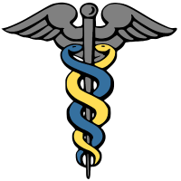

### Overview
I am a clinical data scientist and PhD student in biostatistics. 
My work primarily focuses on applying natural language processing (NLP) and machine learning (ML) 
to support healthcare operations and clinical research. 
As a student, I am currently focused on expanding my quantitative skills and mathematical foundations 
in order to broaden my analytical toolkit.

Here is a [link to my CV](docs/alec-chapman-cv.pdf).
   

### Research Interests
- Natural language processing
- Machine learning
- Secondary data analysis
- Homelessness and other social determinants of health
- Infectious disease surveillance
- Patient safety and quality of care

### Publications
Here are a few select publications which I have been fortunate to be an author on. For a more complete list, see my [CV](docs/alec-chapman-cv.pdf).
- [ReHouSED: A novel measurement of Veteran housing stability using natural language processing](https://www.sciencedirect.com/science/article/pii/S153204642100232X)
- [A Natural Language Processing System for National COVID-19 Surveillance in the US Department of Veterans Affairs](https://aclanthology.org/2020.nlpcovid19-acl.10/)
- [Launching into clinical space with medspaCy: a new clinical text processing toolkit in Python](https://arxiv.org/pdf/2106.07799.pdf)
- [Detecting Adverse Drug Events with Rapidly Trained Classification Models](https://link.springer.com/article/10.1007%2Fs40264-018-0763-y)

### What I'm working on
- [medSpaCy](https://github.com/medspacy/medspacy): An open-source library for performing clinical NLP tasks in spaCy, including implementations of the ConText algorithm for detecting attributes such as negation and experiencer, section detection, and pre/postprocessing

- A system for extracting assertions of pneumonia diagnosis in three types of clinical texts (emergency medicine note, radiology report, and discharge summary) in order to study how pneumonia diagnoses change during a hospitalization
- Applying an NLP system called [ReHouSED](https://www.sciencedirect.com/science/article/pii/S153204642100232X) to study Veteran housing stability across time 
- An NLP system to identify patients who left the hospital againast medical advice

### Educational Work
I previously worked as an adjunct professor at [Utah Valley University](https://www.uvu.edu/), where I teach **INFO-3700: Foundations of Healthcare Informatics**. I've also taught at various summer schools and online workshops. Whenever possible, I try to make my materials available publicly. Here are some links to online courses or tutorials which I've contributed to.
- [Foundations of Healthcare Informatics, Fall 2020](https://github.com/abchapman93/info_3700_fall_2020): Materials include analyzing clinical data with MIMIC, training a machine learning classifier to predict diabetes, and using NLP to extract information from clinical text
- [MIMIC34MD](https://github.com/Melbourne-BMDS/mimic34md2020_materials): A crash course in clinical data science at the University of Melbourne

<!--
**abchapman93/abchapman93** is a ✨ _special_ ✨ repository because its `README.md` (this file) appears on your GitHub profile.

Here are some ideas to get you started:

- 🔭 I’m currently working on ...
- 🌱 I’m currently learning ...
- 👯 I’m looking to collaborate on ...
- 🤔 I’m looking for help with ...
- 💬 Ask me about ...
- 📫 How to reach me: ...
- 😄 Pronouns: ...
- ⚡ Fun fact: ...
-->
